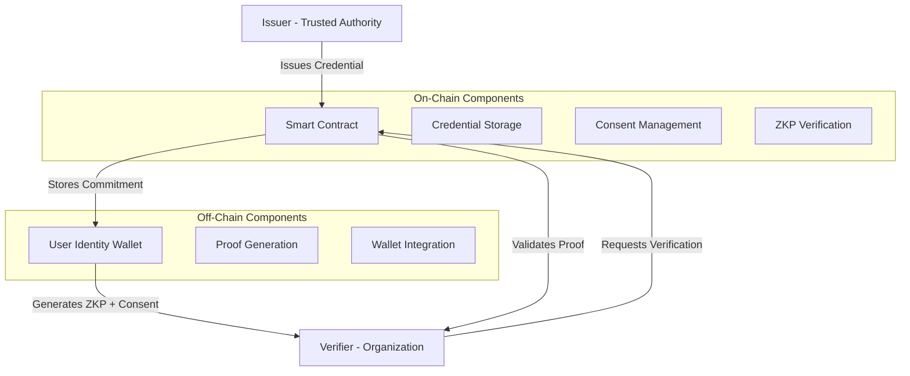

# Design Document: AnonID Self-Sovereign Digital Identity System

## Overview

AnonID is a blockchain-based self-sovereign identity platform that enables users to own their digital identity, receive verifiable credentials from trusted issuers, and prove claims using Zero Knowledge Proofs while maintaining complete privacy. The system leverages smart contracts on Polygon Amoy testnet to provide tamper-proof credential storage, explicit consent management, and cryptographic verification without revealing personal data.

The core innovation lies in treating consent as explicit blockchain transactions, ensuring users maintain full control over who can verify their credentials and when. All personal data remains off-chain, with only cryptographic commitments stored on-chain.

## Architecture

The system follows a decentralized architecture with four main actors:



### Key Architectural Principles

1. **Trust Minimization**: No central authority controls user identities
2. **Privacy by Design**: Personal data never touches the blockchain
3. **Explicit Consent**: Every verification requires user-signed transaction
4. **Cryptographic Integrity**: All claims backed by cryptographic proofs
5. **Auditability**: All actions recorded on public blockchain

## Components and Interfaces

### 1. AnonId Smart Contract

The core smart contract manages the entire identity system lifecycle.

**Core Data Structures:**
```solidity
struct Credential {
    address issuer;        // Who issued this credential
    uint256 issuedAt;     // When it was issued
    bool revoked;         // Current status
}

mapping(bytes32 => Credential) public credentials;
mapping(bytes32 => mapping(address => bool)) public consents;
mapping(address => bool) public trustedIssuers;
```

**Primary Functions:**
- `addTrustedIssuer(address issuer)`: Admin function to authorize credential issuers
- `issueCredential(bytes32 commitment)`: Trusted issuers create new credentials
- `giveConsent(bytes32 commitment, address verifier)`: Users authorize verifications
- `revokeCredential(bytes32 commitment)`: Issuers invalidate credentials
- `revokeConsent(bytes32 commitment, address verifier)`: Users withdraw authorization
- `verifyProof(uint[2] a, uint[2][2] b, uint[2] c, uint[256] input)`: ZKP verification

### 2. Zero Knowledge Proof System

**GROTH16 Implementation:**
The system uses GROTH16 zero-knowledge proofs for privacy-preserving verification. GROTH16 provides:
- Constant-size proofs (3 group elements)
- Fast verification (3 pairings)
- Strong security guarantees
- Compatibility with snarkjs ecosystem

**Proof Structure:**
```solidity
struct Proof {
    uint[2] a;      // First proof element
    uint[2][2] b;   // Second proof element  
    uint[2] c;      // Third proof element
    uint[256] input; // Public input (commitment hash)
}
```

**Verification Logic:**
1. Extract commitment hash from public input
2. Verify credential exists and is not revoked
3. Confirm issuer is trusted
4. Check consent exists for requesting verifier
5. Validate GROTH16 proof cryptographically

### 3. Wallet Integration Layer

**MetaMask Integration:**
- Users connect via browser wallet (MetaMask, WalletConnect)
- Wallet address serves as identity controller
- All transactions require user signature
- No password-based authentication

**Transaction Types:**
- Consent transactions: User authorizes verifier access
- Revocation transactions: User withdraws consent
- Identity management: Key rotation, recovery

### 4. Credential Issuance System

**Issuer Workflow:**
1. Off-chain identity verification (manual or automated)
2. Generate credential data structure
3. Create cryptographic commitment (hash)
4. Submit blockchain transaction with commitment
5. Emit CredentialIssued event

**Commitment Generation:**
```javascript
// Example commitment creation
const credential = {
    subject: userAddress,
    claim: "verified_student",
    institution: "University_XYZ",
    validUntil: timestamp
};
const commitment = keccak256(JSON.stringify(credential));
```

## Data Models

### Credential Model
```solidity
struct Credential {
    address issuer;        // Issuing authority address
    uint256 issuedAt;     // Block timestamp of issuance
    bool revoked;         // Revocation status
}
```

### Consent Model
```solidity
// Nested mapping: commitment => verifier => consent_status
mapping(bytes32 => mapping(address => bool)) consents;
```

### Trusted Issuer Model
```solidity
mapping(address => bool) trustedIssuers;
```

### ZKP Input Model
```solidity
struct ZKPInput {
    bytes32 commitment;    // Credential commitment hash
    address verifier;      // Requesting verifier address
    uint256 timestamp;     // Verification timestamp
}
```

## Correctness Properties

*A property is a characteristic or behavior that should hold true across all valid executions of a system-essentially, a formal statement about what the system should do. Properties serve as the bridge between human-readable specifications and machine-verifiable correctness guarantees.*

### Property 1: Wallet Authentication Controller
*For any* wallet address that connects to the system, the AnonID_System should recognize that address as the controller for all subsequent operations
**Validates: Requirements 1.1**

### Property 2: No Personal Data Storage
*For any* credential issuance or storage operation, the system should never store raw personal data, only cryptographic commitments
**Validates: Requirements 1.2, 2.5**

### Property 3: Action Signature Verification
*For any* system operation, all actions should be properly signed by the user and recorded for auditability
**Validates: Requirements 1.3**

### Property 4: Trusted Issuer Access Control
*For any* credential issuance attempt, the system should only allow issuers that are in the trusted issuers list
**Validates: Requirements 2.1**

### Property 5: Credential Data Completeness
*For any* issued credential, the system should store all required fields: commitment hash, issuer address, timestamp, and status
**Validates: Requirements 2.2**

### Property 6: Credential Issuance Events
*For any* successful credential issuance, the system should emit a CredentialIssued event
**Validates: Requirements 2.3**

### Property 7: Cryptographic Commitment Storage
*For any* credential storage operation, the system should store cryptographic commitments rather than raw credential data
**Validates: Requirements 2.4**

### Property 8: Owner-Only Issuer Management
*For any* attempt to add a trusted issuer, the system should only allow the contract owner to perform this operation
**Validates: Requirements 3.1**

### Property 9: Trusted Issuer Mapping Maintenance
*For any* trusted issuer addition, the system should correctly maintain the mapping of trusted issuer addresses
**Validates: Requirements 3.2**

### Property 10: Issuer Authorization Verification
*For any* credential operation attempt, the system should verify the issuer is trusted before allowing the operation
**Validates: Requirements 3.3**

### Property 11: Issuer Status Modification Control
*For any* attempt to modify trusted issuer status, the system should only allow the contract owner to make changes
**Validates: Requirements 3.4**

### Property 12: GROTH16 Proof Validation
*For any* proof verification request, the system should properly validate all GROTH16 proof parameters (a, b, c, input)
**Validates: Requirements 4.1**

### Property 13: Credential Existence and Status Check
*For any* proof verification, the system should verify the credential exists and is not revoked
**Validates: Requirements 4.2**

### Property 14: Issuer Trust Verification
*For any* proof verification, the system should confirm the credential issuer is trusted
**Validates: Requirements 4.3**

### Property 15: Consent Verification
*For any* proof verification request, the system should check that consent exists for the requesting verifier
**Validates: Requirements 4.4**

### Property 16: Consent Ownership Verification
*For any* consent operation (grant or revoke), the system should verify the user owns the credential
**Validates: Requirements 5.1, 5.5**

### Property 17: Active Credential Consent Requirement
*For any* consent granting attempt, the system should verify the credential is not revoked
**Validates: Requirements 5.2**

### Property 18: Consent Data Recording
*For any* consent granting, the system should record verifier address, scope of access, and timestamp
**Validates: Requirements 5.3**

### Property 19: Consent Events
*For any* successful consent granting, the system should emit a ConsentGiven event
**Validates: Requirements 5.4**

### Property 20: Consent Revocation Availability
*For any* credential owner, the system should allow consent revocation at any time
**Validates: Requirements 5.6**

### Property 21: Credential Revocation Authorization
*For any* credential revocation attempt, the system should verify the caller is the original issuer
**Validates: Requirements 6.1**

### Property 22: Revocation Status Permanence
*For any* credential revocation, the system should mark it as revoked permanently and maintain that status
**Validates: Requirements 6.2, 6.5**

### Property 23: Revocation Events
*For any* successful credential revocation, the system should emit a CredentialRevoked event
**Validates: Requirements 6.3**

### Property 24: Revoked Credential Rejection
*For any* verification attempt on a revoked credential, the system should reject the verification
**Validates: Requirements 6.4**

## Error Handling

The system implements comprehensive error handling across all components:

### Smart Contract Error Handling
- **Access Control Errors**: Revert with descriptive messages when unauthorized access is attempted
- **Invalid State Errors**: Prevent operations on revoked credentials or non-existent commitments
- **Parameter Validation**: Validate all input parameters and revert on invalid data
- **Reentrancy Protection**: Use OpenZeppelin's ReentrancyGuard for state-changing functions

### ZKP Verification Error Handling
- **Invalid Proof Errors**: Return false for malformed or invalid GROTH16 proofs
- **Missing Credential Errors**: Reject proofs for non-existent credentials
- **Consent Errors**: Fail verification when consent is not granted
- **Revocation Errors**: Reject proofs for revoked credentials

### Frontend Error Handling
- **Network Errors**: Handle RPC failures and network connectivity issues
- **Transaction Errors**: Display user-friendly messages for failed transactions
- **Wallet Errors**: Handle wallet connection failures and user rejections
- **Proof Generation Errors**: Handle WASM loading failures and invalid inputs

### Recovery Mechanisms
- **Transaction Retry**: Automatic retry for failed transactions with exponential backoff
- **State Synchronization**: Re-sync frontend state when blockchain state changes
- **Graceful Degradation**: Continue operation with reduced functionality when components fail

## Testing Strategy

The AnonID system employs a comprehensive dual testing approach combining unit tests and property-based tests to ensure correctness and security.

### Property-Based Testing Framework
We will use **Foundry's property-based testing** for Solidity contracts, which provides:
- Built-in fuzzing capabilities
- Invariant testing support
- Gas optimization testing
- Integration with Solidity ecosystem

**Configuration Requirements:**
- Minimum 100 iterations per property test
- Each test tagged with: **Feature: anon-id, Property {number}: {property_text}**
- Tests must reference their corresponding design document property

### Unit Testing Approach
Unit tests focus on:
- **Specific Examples**: Concrete scenarios that demonstrate correct behavior
- **Edge Cases**: Boundary conditions, empty inputs, maximum values
- **Error Conditions**: Invalid inputs, unauthorized access, state violations
- **Integration Points**: Component interactions and data flow

### Property Testing Approach
Property tests validate:
- **Universal Properties**: Behaviors that must hold for all valid inputs
- **Invariants**: System state that must remain consistent
- **Access Control**: Authorization rules across all operations
- **Data Integrity**: Cryptographic commitments and storage consistency

### Test Coverage Strategy
- **Smart Contract Tests**: 100% function coverage, all state transitions
- **ZKP Circuit Tests**: Proof generation and verification correctness
- **Integration Tests**: End-to-end workflows from credential issuance to verification
- **Security Tests**: Reentrancy, overflow, access control vulnerabilities

### Testing Tools and Libraries
- **Foundry**: Solidity testing framework with built-in fuzzing
- **Hardhat**: Development environment and testing utilities
- **snarkjs**: ZKP circuit testing and proof generation
- **Chai/Mocha**: JavaScript testing for frontend components

The dual approach ensures comprehensive coverage: unit tests catch specific bugs and edge cases, while property tests verify general correctness across all possible inputs.